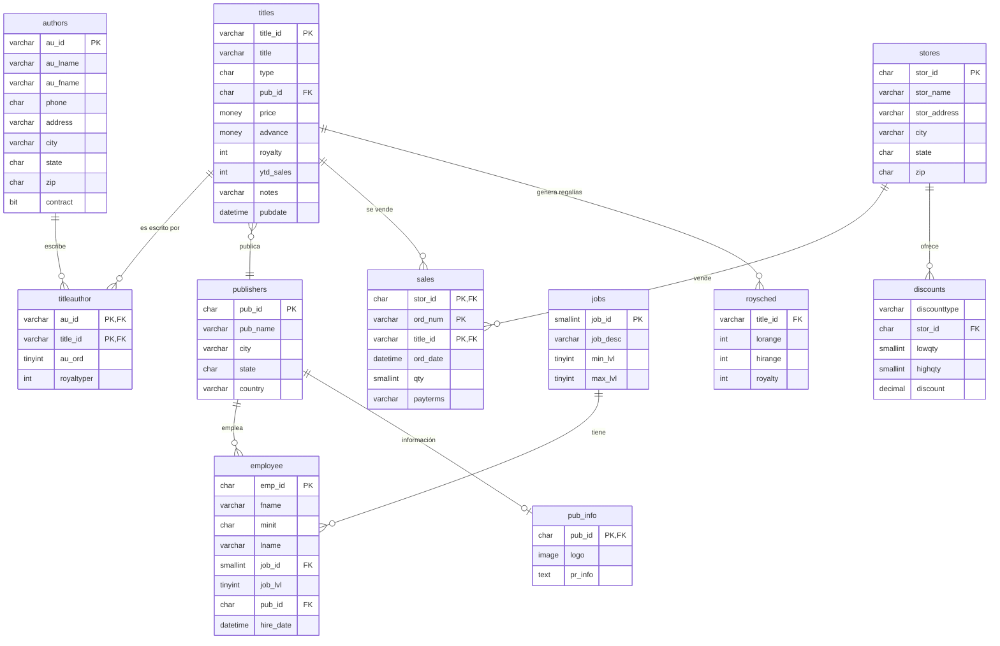
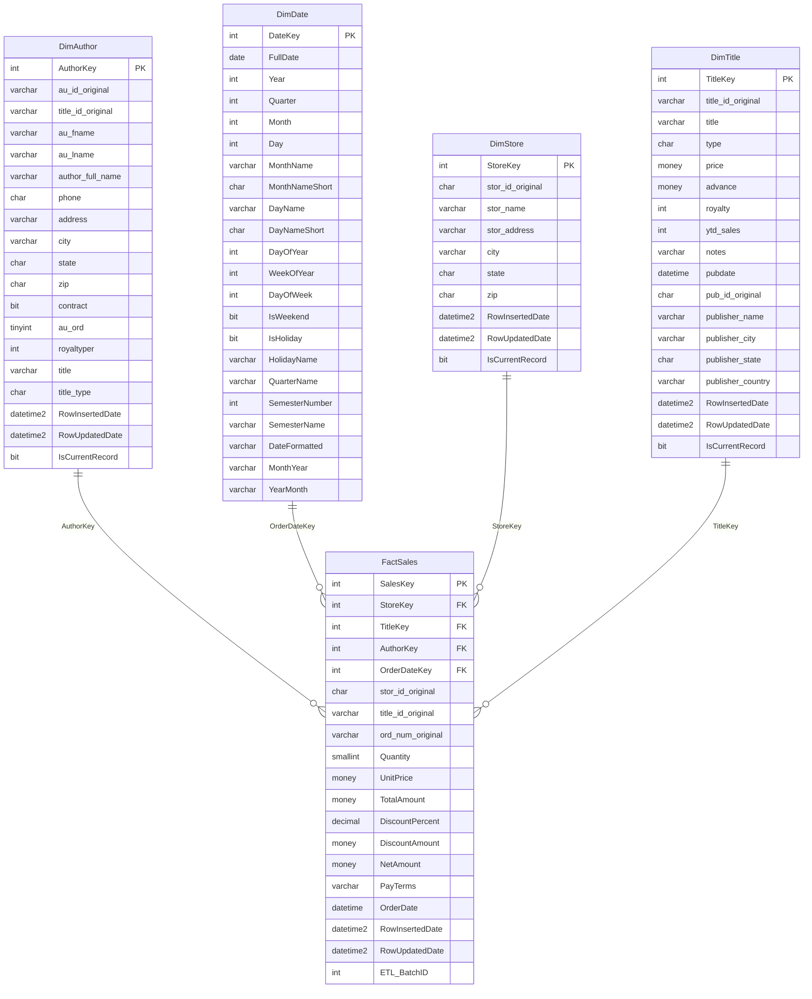

# Base de Datos PUBS - Proyecto SQL Server

## 📚 Descripción

Base de datos de sistema editorial que gestiona **autores**, **libros**, **editoriales** y **ventas**.

**Características:**
- 12 tablas principales
- 10 relaciones (FK)

## 🔗 Diagrama Entidad-Relación



## 📊 Entidades Principales

- **📖 titles** - Catálogo de libros y publicaciones
- **✍️ authors** - Escritores y colaboradores  
- **🏢 publishers** - Casas editoras
- **🏪 stores** - Librerías y puntos de venta
- **👥 employee** - Personal de la editorial
- **💰 sales** - Transacciones de venta
- **🏷️ discounts** - Descuentos por tienda
- **💸 roysched** - Esquemas de regalías
- **ℹ️ pub_info** - Información detallada de editoriales
- **💼 jobs** - Cargos y puestos de trabajo

## 🔗 Relaciones Clave

**N:M** - Autores ↔ Libros (tabla: `titleauthor`)  
**1:N** - Editorial → Empleados  
**1:N** - Editorial → Libros  
**1:N** - Librería → Ventas  
**1:N** - Librería → Descuentos  
**1:N** - Libros → Regalías  
**1:1** - Editorial → Información detallada  

## 📁 Estructura del Proyecto

```
DatabaseProjectPubs/
├── README.md
├── BDPubs/
│   ├── BDPubsOLTP/                        ← Sistema Transaccional
│   │   ├── DatabaseProjectPubs.sqlproj
│   │   └── Schema/
│   │       ├── StoredProcedures/
│   │       │   ├── GetDatabaseRowVersion.sql
│   │       │   ├── GetSalesChangeByRowVersion.sql
│   │       │   ├── GetStoresChangeByRowVersion.sql
│   │       │   └── GetTitleChangeByRowVersion.sql
│   │       ├── Tables/
│   │       └── Views/
│   └── BDPubsDW/                          ← Data Warehouse
│       ├── Schema/
│       │   ├── Programmability/
│       │   │   └── Stored Procedures/
│       │   │       ├── DW_MergeDimStore.sql
│       │   │       ├── DW_MergeDimTitle.sql
│       │   │       ├── DW_MergeDimAuthor.sql
│       │   │       ├── DW_MergeFactSales.sql
│       │   │       ├── GetLastPackageRowVersion.sql
│       │   │       └── UpdateLastPackageRowVersion.sql
│       │   ├── Security/
│       │   │   └── schemas/
│       │   │       └── staging.sql
│       │   └── Tables/
│       │       ├── dbo/
│       │       │   ├── DimStore.sql
│       │       │   ├── DimTitle.sql
│       │       │   ├── DimAuthor.sql
│       │       │   ├── DimDate.sql
│       │       │   └── FactSales.sql
│       │       └── staging/
│       │           ├── staging.store.sql
│       │           ├── staging.title.sql
│       │           ├── staging.author.sql
│       │           └── staging.sales.sql
│       └── Scripts/
│           ├── PackageConfig.data.sql
│           ├── DimDate.data.sql
│           └── Script.PostDeployment.sql
```

# Modelo Estrella - Pubs Data Warehouse

Este es el modelo estrella basado en las tablas `DimAuthor`, `DimDate`, `DimStore`, `DimTitle` y la tabla de hechos `FactSales`.

## Diagrama ER (Mermaid)



---

# 🛠️ Setup e Implementación

## 📋 Prerequisitos

**Software requerido:**
- **Cualquier plataforma:** SQL Server Management Studio (SSMS) o Azure Data Studio
- **Windows únicamente:** Visual Studio con SQL Server Data Tools (SSDT) para SSIS

## 🧪 Testing Manual (Mac/Linux/Windows)

### 1. Setup Inicial
```sql
-- Crear Data Warehouse
CREATE DATABASE PubsDataWarehouse;
GO

-- Usar base de datos
USE PubsDataWarehouse;
GO
```

### 2. Deploy Estructura
```sql
-- Ejecutar scripts en orden:
-- 1. BDPubs/BDPubsDW/Schema/Security/schemas/staging.sql
-- 2. BDPubs/BDPubsDW/Schema/Tables/dbo/*.sql (todas las dimensiones)
-- 3. BDPubs/BDPubsDW/Schema/Tables/staging/*.sql (tablas staging)
-- 4. BDPubs/BDPubsDW/Schema/Programmability/Stored Procedures/*.sql
-- 5. BDPubs/BDPubsDW/Scripts/PackageConfig.data.sql
-- 6. BDPubs/BDPubsDW/Scripts/DimDate.data.sql
```

### 3. Verificar Setup
```sql
-- Verificar tablas creadas
SELECT name FROM sys.tables ORDER BY name;

-- Verificar DimDate poblada
SELECT COUNT(*) AS TotalDates FROM DimDate;

-- Verificar PackageConfig
SELECT * FROM PackageConfig;
```

### 4. Test Stored Procedures
```sql
-- Test ETL control procedures
EXEC GetLastPackageRowVersion 'stores';
EXEC UpdateLastPackageRowVersion 'stores', 12345;

-- Test CDC procedures (en base PUBS)
USE pubs;
EXEC GetDatabaseRowVersion;
EXEC GetStoresChangeByRowVersion 0, 999999999;
EXEC GetAuthorChangeByRowVersion 0, 999999999;
```

### 5. Simulación ETL Manual (Flujo Completo)
```sql
USE PubsDataWarehouse;

-- Test 1: Cargar Tiendas
INSERT INTO staging.store (stor_id, stor_name, stor_address, city, state, zip)
SELECT stor_id, stor_name, stor_address, city, state, zip 
FROM pubs.dbo.stores;

EXEC DW_MergeDimStore;
SELECT COUNT(*) AS StoresInDimension FROM DimStore;
-- Resultado esperado: 6 registros

-- Test 2: Cargar Títulos  
INSERT INTO staging.title (title_id, title, type, price, pub_name)
SELECT title_id, title, type, price, 'Test Publisher'
FROM pubs.dbo.titles;

EXEC DW_MergeDimTitle;
SELECT COUNT(*) AS TitlesInDimension FROM DimTitle;
-- Resultado esperado: 18 registros

-- Test 3: Cargar Autores
INSERT INTO staging.author (au_id, title_id, au_fname, au_lname, phone, address, city, state, zip, contract, au_ord, royaltyper, title, title_type)
EXEC pubs.dbo.GetAuthorChangeByRowVersion 0, 999999999;

EXEC DW_MergeDimAuthor;
SELECT COUNT(*) AS AuthorsInDimension FROM DimAuthor;
-- Resultado esperado: ~25 registros

-- Test 4: Cargar Ventas (tabla de hechos - DESPUÉS de todas las dimensiones)
INSERT INTO staging.sales (stor_id, ord_num, title_id, ord_date, qty, payterms, unit_price)
SELECT stor_id, ord_num, title_id, ord_date, qty, payterms, 
       (SELECT TOP 1 price FROM pubs.dbo.titles WHERE titles.title_id = sales.title_id)
FROM pubs.dbo.sales;

EXEC DW_MergeFactSales;
SELECT COUNT(*) AS SalesInFact FROM FactSales;
-- Resultado esperado: 21 registros

-- Verificación final: ETL completo funcionando
SELECT 
    'DimStore' AS Tabla, COUNT(*) AS Registros FROM DimStore
UNION ALL
SELECT 'DimTitle', COUNT(*) FROM DimTitle  
UNION ALL
SELECT 'DimAuthor', COUNT(*) FROM DimAuthor
UNION ALL
SELECT 'FactSales', COUNT(*) FROM FactSales;
```

---

# 🚀 SSIS Automation (Windows Only)

## Prerequisitos Windows
- Visual Studio 2019/2022
- SQL Server Data Tools (SSDT)
- SQL Server Integration Services

## Setup Instructions

### 1. Abrir Solution
```bash
# Navegar al directorio del proyecto
cd DatabaseProjectPubs/BDPubs/

# Abrir en Visual Studio:
# - BDPubsBI.sln (Solution principal)
# - BDPubsDW.sqlproj (Database Project)  
# - BDPubsETL.dtproj (SSIS Project)
```

### 2. Configurar Connection Managers
```
Connection 1: PUBS_OLTP
- Type: OLEDB
- Server: [SQL Server Instance]
- Database: pubs

Connection 2: PUBS_DW
- Type: OLEDB  
- Server: [SQL Server Instance]
- Database: PubsDataWarehouse
```

### 3. SSIS Packages Incluidos
- **DimStore.dtsx** - ETL para dimensión tiendas
- **DimTitle.dtsx** - ETL para dimensión títulos
- **DimAuthor.dtsx** - ETL para dimensión autores
- **FactSales.dtsx** - ETL para tabla de hechos
- **MasterETL.dtsx** - Orquestador principal

### 4. Arquitectura de Packages
```
[Get Last RowVersion] → [Get Current RowVersion] → [Data Flow] → [Merge] → [Update Config]
```

### 5. Deployment
```sql
-- Deploy to Integration Services Catalog
-- Ejecutar packages via SSMS o SQL Server Agent
```

---

# 📊 Validación

## Consultas Básicas de Verificación

```sql
-- Estadísticas generales
SELECT 
    'DimStore' AS Tabla, COUNT(*) AS Registros FROM DimStore
UNION ALL
SELECT 'DimTitle', COUNT(*) FROM DimTitle  
UNION ALL
SELECT 'DimAuthor', COUNT(*) FROM DimAuthor
UNION ALL  
SELECT 'FactSales', COUNT(*) FROM FactSales
UNION ALL
SELECT 'DimDate', COUNT(*) FROM DimDate;

-- Top 5 tiendas por ventas
SELECT TOP 5
    ds.stor_name,
    COUNT(*) AS TotalOrders,
    SUM(fs.TotalAmount) AS Revenue
FROM FactSales fs
JOIN DimStore ds ON fs.StoreKey = ds.StoreKey
GROUP BY ds.stor_name
ORDER BY Revenue DESC;

-- Ventas por mes
SELECT 
    dd.MonthYear,
    COUNT(*) AS Orders,
    SUM(fs.TotalAmount) AS Revenue
FROM FactSales fs
JOIN DimDate dd ON fs.OrderDateKey = dd.DateKey  
GROUP BY dd.MonthYear
ORDER BY dd.MonthYear;
```

---

# 🔄 Orden de Ejecución

## Primera vez (Full Load)
1. **Setup manual** - Crear estructura DW
2. **Test procedures** - Verificar stored procedures funcionan
3. **SSIS (Windows)** - Ejecutar MasterETL.dtsx

## Ejecución Incremental
- **Manual:** Ejecutar procedures individuales con RowVersion
- **SSIS:** SQL Server Agent job ejecutando MasterETL.dtsx

---

*Este proyecto implementa un Data Warehouse completo siguiendo metodología Kimball con capacidad de testing manual multiplataforma y automatización SSIS en Windows.*