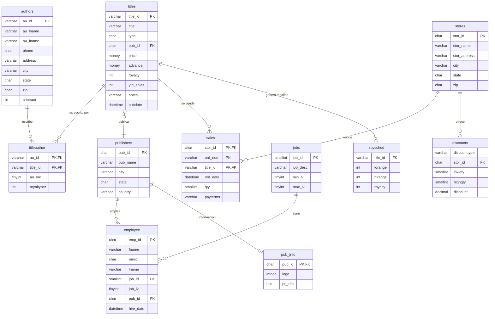

# Base de Datos PUBS - Proyecto SQL Server

## 📚 Descripción

Base de datos de sistema editorial que gestiona **autores**, **libros**, **editoriales** y **ventas**.

**Características:**
- 12 tablas principales
- 10 relaciones (FK)

## 🔗 Diagrama Entidad-Relación



## 📊 Entidades Principales

- **📖 titles** - Catálogo de libros y publicaciones
- **✍️ authors** - Escritores y colaboradores  
- **🏢 publishers** - Casas editoras
- **🏪 stores** - Librerías y puntos de venta
- **👥 employee** - Personal de la editorial
- **💰 sales** - Transacciones de venta
- **🏷️ discounts** - Descuentos por tienda
- **💸 roysched** - Esquemas de regalías
- **ℹ️ pub_info** - Información detallada de editoriales
- **💼 jobs** - Cargos y puestos de trabajo

## 🔗 Relaciones Clave

**N:M** - Autores ↔ Libros (tabla: `titleauthor`)  
**1:N** - Editorial → Empleados  
**1:N** - Editorial → Libros  
**1:N** - Librería → Ventas  
**1:N** - Librería → Descuentos  
**1:N** - Libros → Regalías  
**1:1** - Editorial → Información detallada  

## 📁 Estructura del Proyecto

```
DatabaseProjectPubs/
├── README.md
├── DatabaseProjectPubs.sqlproj
├── dbo/
│   ├── Tables/
│   │   ├── authors.sql
│   │   ├── discounts.sql
│   │   ├── employee.sql
│   │   ├── jobs.sql
│   │   ├── pub_info.sql
│   │   ├── publishers.sql
│   │   ├── roysched.sql
│   │   ├── sales.sql
│   │   ├── stores.sql
│   │   ├── titleauthor.sql
│   │   └── titles.sql
│   ├── StoredProcedures/
│   │   ├── byroyalty.sql
│   │   ├── GetDatabaseRowVersion.sql
│   │   ├── GetSalesChangeByRowVersion.sql
│   │   ├── GetStoresChangeByRowVersion.sql
│   │   ├── GetTitleChangeByRowVersion.sql
│   │   ├── reptq1.sql
│   │   ├── reptq2.sql
│   │   └── reptq3.sql
│   ├── Views/
│   │   └── titleview.sql
│   └── UserDefinedTypes/
│       ├── empid.sql
│       ├── id.sql
│       └── tid.sql
└── Security/
    └── staging.sql
```
